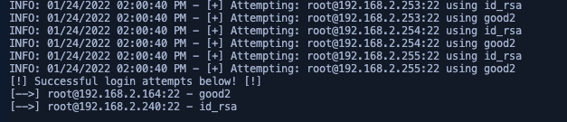

# ssh_key_brute
Multi-threaded python script for testing ssh keys against multiple servers.

For when you find a key and really need to know where it goes.

## Installation

> Note: I HIGHLY recommend using a vitual environment for this script to keep dependencies in check.

```
git clone https://github.com/passkwall/ssh_key_brute.git
cd ssh_key_brute/
virtualenv venv
source venv/bin/activate
pip3 install -r requirements
```

## Usage



The script allows a few things:
- CIDR range of IP addresses
- Usernames and private key files separated by commas

```
python3 key_brute.py -iL 10.10.10.0/24 -f key1,key2 -u root,user1,user2 -t 20
```

## Known issues and limitations
- No userlists or IPs from a file
- Random paramiko errors at the beginning - annoying but doesn't hurt everything
- No limit on threading - exceeding more than 20 threads in the pool is done at your own risk